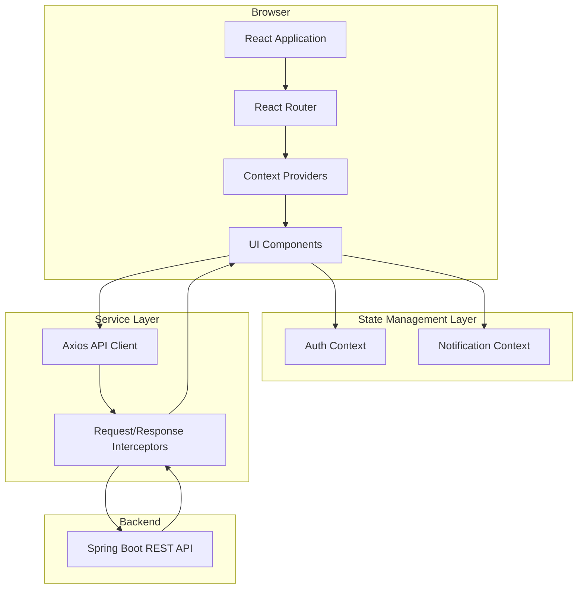
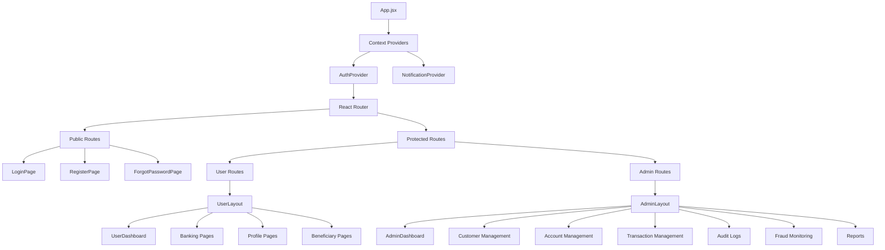

# Banking System Frontend - Design Document

## Overview

The Banking System Frontend is a comprehensive React-based web application providing secure online banking interfaces for both users and administrators. Built with modern web technologies (React 19, Vite, React Router 6, Bootstrap 5, Axios, React Hook Form, and Context API), the application serves as a client-side interface that communicates exclusively with a Spring Boot REST API backend.

### Core Design Principles

1. **Separation of Concerns**: Frontend contains no business logic or database operations - all data operations occur through REST API calls
2. **Component-Based Architecture**: Modular, reusable components organized by feature and responsibility
3. **Type Safety**: Consistent data structures matching backend DTOs for reliable API contracts
4. **Responsive Design**: Mobile-first approach ensuring usability across all device sizes
5. **Performance Optimization**: Code splitting, lazy loading, and memoization for fast load times
6. **Security First**: Protected routes, secure token management, and proper error handling
7. **Maintainability**: Clear project structure, consistent naming conventions, and separation of container/presentational components

### Technology Stack Rationale

- **React 19**: Latest stable version with improved performance and concurrent features
- **Vite**: Fast build tool with HMR for superior developer experience
- **React Router 6**: Modern routing with nested routes and data loading patterns
- **Bootstrap 5**: Mature CSS framework with comprehensive responsive utilities
- **Axios**: Promise-based HTTP client with interceptor support for global request/response handling
- **React Hook Form**: Performant form library using uncontrolled components for minimal re-renders
- **Context API**: Built-in React state management suitable for authentication and global UI state


## Architecture

### High-Level Architecture



### Application Flow

1. **Application Initialization**
   - App loads and mounts Context Providers (AuthContext, NotificationContext)
   - AuthContext checks localStorage for existing session token
   - If token exists, validates with API and restores session
   - Router renders appropriate route based on authentication state

2. **Authentication Flow**
   - User submits login credentials via React Hook Form
   - Form validation occurs client-side
   - Valid credentials sent to REST API via Axios
   - API returns JWT token and user data
   - AuthContext stores token in localStorage and memory
   - Axios interceptor automatically adds token to subsequent requests
   - User redirected to role-appropriate dashboard

3. **Protected Route Access**
   - User navigates to protected route
   - ProtectedRoute component checks AuthContext for valid session
   - If unauthenticated: redirect to login
   - If authenticated but wrong role: redirect to appropriate dashboard
   - If authorized: render requested component


4. **Data Fetching Flow**
   - Component mounts and triggers data fetch via API service
   - Loading state displayed (spinner or skeleton loader)
   - Axios interceptor adds authentication token
   - API request sent to Spring Boot backend
   - Response interceptor handles success/error scenarios
   - On success: data rendered in component
   - On error: error toast displayed with appropriate message
   - On 401: AuthContext cleared, redirect to login
   - On 403: unauthorized message displayed

5. **Form Submission Flow**
   - User fills form with React Hook Form
   - Real-time client-side validation with visual feedback
   - Submit button disabled until validation passes
   - On submit: form data sent to API via Axios
   - Loading state prevents duplicate submissions
   - Success: success toast, data refresh, potential redirect
   - Error: error toast with server message, form remains editable

### Layered Architecture

The application follows a clean layered architecture:


**Presentation Layer** (Components)
- User-facing UI components
- Page/container components orchestrating feature logic
- Presentational components rendering UI based on props
- No direct API calls or business logic

**State Management Layer** (Context)
- AuthContext: authentication state, user data, session management
- NotificationContext: toast notifications and alerts
- Provides shared state without prop drilling

**Service Layer** (API Client)
- Axios instance with base configuration
- Request/response interceptors for cross-cutting concerns
- Service modules per feature (authService, accountService, etc.)
- Handles all HTTP communication with backend

**Backend Integration Layer** (REST API)
- Spring Boot REST API (external system)
- Provides all business logic and data operations
- Returns standardized response formats
- JWT-based authentication


## Components and Interfaces

### Component Hierarchy




### Core Component Specifications

#### App Component
**Purpose**: Root application component orchestrating providers and routing

**Responsibilities**:
- Wrap application with Context Providers
- Initialize Axios interceptors
- Render Router configuration
- Handle global error boundaries

**Props**: None (root component)

**State**: None (delegates to contexts)

#### AuthProvider Component
**Purpose**: Manage authentication state and session persistence

**State**:
```javascript
{
  user: {
    id: string,
    email: string,
    name: string,
    role: 'USER' | 'ADMIN',
    accountNumber: string
  } | null,
  token: string | null,
  isAuthenticated: boolean,
  isLoading: boolean
}
```


**Methods**:
- `login(credentials)`: Authenticate user and store session
- `logout()`: Clear session and redirect to login
- `register(userData)`: Create new user account
- `checkSession()`: Validate existing token on app load
- `updateUser(userData)`: Update user profile information

**Context Value**:
```javascript
{
  user,
  token,
  isAuthenticated,
  isLoading,
  login,
  logout,
  register,
  updateUser
}
```

#### ProtectedRoute Component
**Purpose**: Guard routes based on authentication and role

**Props**:
```javascript
{
  children: ReactNode,
  requiredRole?: 'USER' | 'ADMIN' | null,
  redirectTo?: string
}
```

**Logic**:
1. Check `isAuthenticated` from AuthContext
2. If not authenticated: redirect to login
3. If `requiredRole` specified and user role doesn't match: redirect to appropriate dashboard
4. Otherwise: render children components


#### NotificationProvider Component
**Purpose**: Manage toast notifications for user feedback

**State**:
```javascript
{
  notifications: Array<{
    id: string,
    type: 'success' | 'error' | 'warning' | 'info',
    message: string,
    duration: number
  }>
}
```

**Methods**:
- `showSuccess(message, duration?)`: Display success toast
- `showError(message, duration?)`: Display error toast
- `showWarning(message, duration?)`: Display warning toast
- `showInfo(message, duration?)`: Display info toast
- `removeNotification(id)`: Dismiss specific notification

**Context Value**:
```javascript
{
  notifications,
  showSuccess,
  showError,
  showWarning,
  showInfo
}
```


### Layout Components

#### UserLayout Component
**Purpose**: Common layout structure for user-facing pages

**Structure**:
- Responsive sidebar with user navigation menu
- Top navigation bar with profile dropdown and logout
- Breadcrumb navigation
- Main content area with outlet for nested routes
- Footer with copyright information

**Features**:
- Collapsible sidebar on mobile devices
- Active menu item highlighting based on current route
- Responsive breakpoints: mobile (<768px), tablet (768-1199px), desktop (≥1200px)

#### AdminLayout Component
**Purpose**: Common layout structure for admin pages

**Structure**: Similar to UserLayout but with admin-specific navigation items

**Navigation Sections**:
- Dashboard
- Customer Management (List, Create, View)
- Account Management (List, View)
- Transaction Management (List, Search)
- Audit Logs (Activity, Login History, Transaction Logs)
- Fraud Monitoring
- Reports (Daily, Monthly)


### Feature Components

#### Authentication Components

**LoginPage**
- Email and password fields with React Hook Form validation
- "Remember me" checkbox (optional future enhancement)
- Links to registration and forgot password
- Submit triggers `authService.login()` → `AuthContext.login()`
- Redirects to role-appropriate dashboard on success

**RegisterPage**
- Form fields: name, email, phone, password, confirm password
- Real-time validation with error display
- Submit triggers `authService.register()` → `AuthContext.register()`
- Redirects to login with success message

**ForgotPasswordPage**
- Email field with validation
- Submit triggers `authService.forgotPassword()`
- Success message with instructions to check email

**ResetPasswordPage**
- New password and confirm password fields
- Token extracted from URL query parameters
- Submit triggers `authService.resetPassword(token, newPassword)`
- Redirects to login on success


#### User Dashboard Components

**UserDashboard**
- Welcome card displaying user name
- Account balance card with current balance and account number
- Recent transactions list (last 5 transactions)
- Quick action cards (Deposit, Withdraw, Transfer) with navigation
- Notifications panel showing system notifications
- All data fetched from multiple API endpoints on mount
- Loading skeletons during data fetch
- Error states with retry functionality

**AccountBalanceCard**
- Props: `balance: number`, `accountNumber: string`, `isLoading: boolean`
- Displays formatted balance with currency symbol
- Shows masked account number with copy-to-clipboard functionality

**RecentTransactionsCard**
- Props: `transactions: Transaction[]`, `isLoading: boolean`
- Table displaying transaction date, type, amount, status
- "View All" link to transaction history page
- Empty state when no transactions exist

**QuickActionCard**
- Props: `title: string`, `icon: string`, `link: string`, `description: string`
- Clickable card navigating to respective operation page
- Icon and title with brief description


#### Banking Operation Components

**DepositPage**
- Form with amount and description fields
- Amount validation: positive number, max 2 decimal places
- Submit triggers `bankingService.deposit(data)`
- Success: toast notification + redirect to dashboard

**WithdrawPage**
- Form with amount and description fields
- Amount validation: positive number, sufficient balance check on server
- Submit triggers `bankingService.withdraw(data)`
- Success: toast notification + redirect to dashboard

**TransferPage**
- Beneficiary dropdown/select populated from API
- Amount and description fields
- "Add beneficiary" link to beneficiary management
- Submit triggers `bankingService.transfer(data)`
- Success: toast notification + redirect to dashboard

**TransactionHistoryPage**
- Paginated table of all user transactions
- Columns: Date, Type, Amount, Status, Description, Actions
- Pagination controls with page size selection (10, 25, 50, 100)
- Click row to view transaction details
- Export button (future enhancement)


**TransactionDetailPage**
- Transaction ID from URL parameter
- Complete transaction information display
- Fields: ID, Date/Time, Type, Amount, Status, From/To Account, Description, Reference Number
- "Back to History" navigation button
- Print/Download receipt button (future enhancement)

#### Beneficiary Management Components

**BeneficiaryListPage**
- Grid/card layout of beneficiaries
- Each card: name, account number, bank name, edit/delete actions
- "Add Beneficiary" button opening modal/navigating to form
- Empty state when no beneficiaries exist
- Confirmation dialog before delete

**BeneficiaryFormModal**
- Props: `mode: 'create' | 'edit'`, `beneficiary?: Beneficiary`, `onClose: Function`, `onSuccess: Function`
- Form fields: name, account number, bank name, branch code (optional)
- Account number format validation
- Create: `beneficiaryService.create(data)`
- Edit: `beneficiaryService.update(id, data)`
- Success: refresh list + close modal + toast


#### Profile Management Components

**ViewProfilePage**
- Display-only user information
- Fields: Name, Email, Phone, Account Number, Registration Date, Status
- "Edit Profile" button navigating to edit page
- "Change Password" button navigating to password change page

**EditProfilePage**
- Editable form: name, email, phone
- Pre-populated with current user data
- Submit triggers `profileService.updateProfile(data)`
- Success: update AuthContext user data + toast + redirect to view

**ChangePasswordPage**
- Form fields: current password, new password, confirm new password
- Validation: passwords match, meets strength requirements
- Submit triggers `profileService.changePassword(data)`
- Success: toast + redirect to profile view


#### Admin Dashboard Components

**AdminDashboard**
- Statistics cards: Total Customers, Total Accounts, Total Deposits, Total Withdrawals, Total Transfers
- Customer growth chart (simple bar/line chart)
- Recent transactions table (system-wide, last 10)
- Quick links to management sections
- All data fetched from admin statistics API endpoint

**StatisticCard**
- Props: `title: string`, `value: number`, `icon: string`, `trend?: number`, `isLoading: boolean`
- Displays formatted value with icon
- Optional trend indicator (percentage change)
- Loading skeleton during fetch

#### Admin Customer Management Components

**CustomerListPage**
- Paginated table: ID, Name, Email, Phone, Status, Account Number, Actions
- Search bar with debounced input (search by name or account number)
- Filter by status: All, Active, Disabled
- Actions per row: View, Edit, Enable/Disable
- "Create Customer" button

**CustomerDetailPage**
- Customer ID from URL parameter
- Complete customer information display
- Account details section
- Transaction summary for customer
- Action buttons: Edit, Enable/Disable Account


**CustomerFormPage**
- Props: `mode: 'create' | 'edit'`
- Form fields: Name, Email, Phone, Address, Date of Birth, ID Number
- Pre-populated in edit mode
- Validation for all fields
- Create: `customerService.create(data)` → redirect to list
- Edit: `customerService.update(id, data)` → redirect to detail

#### Admin Account Management Components

**AccountListPage**
- Paginated table: Account Number, Customer Name, Balance, Status, Type, Actions
- Search by account number or customer name
- Filter by status: All, Active, Frozen, Closed
- Actions: View Details, Freeze/Unfreeze, Close

**AccountDetailPage**
- Account number from URL parameter
- Account information: number, type, balance, status, opening date
- Associated customer information
- Recent transactions for this account
- Action buttons: Freeze/Unfreeze, Close (with confirmation)


#### Admin Transaction Management Components

**TransactionListPage**
- Paginated table: Transaction ID, Date, Type, Amount, From Account, To Account, Status
- Search by transaction ID or account number
- Filters: Date range picker, Transaction type dropdown, Status dropdown
- Apply filters triggers API call with query parameters
- Export transactions button (triggers download from API)

**TransactionDetailPage** (Admin View)
- Transaction ID from URL parameter
- Complete transaction details
- Associated customer information
- Status history/audit trail
- Admin notes section (future enhancement)

#### Audit Log Components

**AuditLogPage**
- Tabs: User Activity, Login History, Transaction Logs
- Each tab shows paginated table
- Date range filter applicable to all tabs
- User Activity: User, Action, Resource, Timestamp, IP Address
- Login History: User, Login Time, Logout Time, IP Address, Status
- Transaction Logs: Transaction ID, User, Action, Timestamp, Details


#### Fraud Monitoring Components

**FraudMonitoringPage**
- Risk indicator cards: High-Risk Transactions Count, Suspicious Activity Count, Total Flagged Amount
- Suspicious transactions table with warning badges
- Filters: Risk level, Date range, Amount threshold
- Each transaction row shows: ID, Account, Amount, Risk Score, Reason, Actions
- Action: "Investigate" button (navigates to detail with admin context)

#### Reports Components

**ReportsPage**
- Tabs: Daily Reports, Monthly Reports
- Date selector for report period
- Summary cards: Total Transactions, Total Deposits, Total Withdrawals, Net Change
- Transactions table for selected period
- Export buttons: PDF, Excel, CSV (triggers API download endpoint)

### Reusable Component Library

**DataTable Component**
- Props: `columns: ColumnDef[]`, `data: any[]`, `pagination: PaginationConfig`, `onPageChange`, `onSort`, `isLoading`
- Features: Sortable columns, pagination, custom cell renderers, row actions
- Responsive: horizontal scroll on small screens


**FormField Component**
- Props: `name`, `label`, `type`, `validation`, `placeholder`, `error`, `...inputProps`
- Integrates with React Hook Form
- Displays label, input, and error message
- Applies Bootstrap validation classes

**Modal Component**
- Props: `isOpen`, `onClose`, `title`, `children`, `footer`, `size`
- Backdrop click and ESC key to close
- Customizable header, body, footer
- Size variants: small, medium, large, full-screen

**ConfirmDialog Component**
- Props: `isOpen`, `onClose`, `onConfirm`, `title`, `message`, `confirmText`, `cancelText`, `variant`
- Used before destructive actions (delete, disable, close account)
- Variant: default, danger (red confirm button)

**LoadingSpinner Component**
- Props: `size`, `color`, `fullScreen`
- Centered spinner for loading states
- Full-screen overlay variant for initial page loads

**SkeletonLoader Component**
- Props: `count`, `height`, `width`, `variant`
- Variants: text, rectangular, circular
- Mimics shape of content being loaded


**Toast Component**
- Rendered by NotificationProvider
- Auto-dismiss after duration (default 5 seconds)
- Click to dismiss manually
- Stacked positioning for multiple toasts
- Variants: success (green), error (red), warning (yellow), info (blue)

**EmptyState Component**
- Props: `icon`, `title`, `message`, `actionLabel`, `onAction`
- Displayed when data lists/tables are empty
- Optional call-to-action button

**StatusBadge Component**
- Props: `status`, `label`, `variant`
- Color-coded badges for statuses: Active (green), Inactive (gray), Pending (yellow), Frozen (blue), Closed (red)

**SearchBar Component**
- Props: `onSearch`, `placeholder`, `debounceMs`, `initialValue`
- Debounced input to reduce API calls
- Clear button when input has value
- Search icon

**Pagination Component**
- Props: `currentPage`, `totalPages`, `pageSize`, `onPageChange`, `onPageSizeChange`, `pageSizeOptions`
- Previous/Next buttons
- Page number display and input
- Page size selector dropdown


## Data Models

### Frontend Data Structures

The frontend defines TypeScript interfaces/PropTypes matching backend DTOs for type safety and IntelliSense support.

**User Model**
```javascript
{
  id: string,
  email: string,
  name: string,
  phone: string,
  role: 'USER' | 'ADMIN',
  accountNumber: string,
  status: 'ACTIVE' | 'DISABLED',
  createdAt: string (ISO 8601),
  updatedAt: string (ISO 8601)
}
```

**Account Model**
```javascript
{
  id: string,
  accountNumber: string,
  accountType: 'SAVINGS' | 'CURRENT',
  balance: number,
  status: 'ACTIVE' | 'FROZEN' | 'CLOSED',
  userId: string,
  createdAt: string,
  updatedAt: string
}
```


**Transaction Model**
```javascript
{
  id: string,
  transactionType: 'DEPOSIT' | 'WITHDRAWAL' | 'TRANSFER',
  amount: number,
  description: string,
  status: 'PENDING' | 'COMPLETED' | 'FAILED',
  fromAccountNumber: string,
  toAccountNumber: string | null,
  referenceNumber: string,
  createdAt: string,
  completedAt: string | null
}
```

**Beneficiary Model**
```javascript
{
  id: string,
  name: string,
  accountNumber: string,
  bankName: string,
  branchCode: string | null,
  userId: string,
  createdAt: string
}
```

**Customer Model (Admin)**
```javascript
{
  id: string,
  name: string,
  email: string,
  phone: string,
  address: string,
  dateOfBirth: string,
  idNumber: string,
  status: 'ACTIVE' | 'DISABLED',
  accounts: Account[],
  createdAt: string,
  updatedAt: string
}
```


**AuditLog Model**
```javascript
{
  id: string,
  userId: string,
  userName: string,
  action: string,
  resource: string,
  ipAddress: string,
  userAgent: string,
  timestamp: string
}
```

**Statistics Model (Admin Dashboard)**
```javascript
{
  totalCustomers: number,
  totalAccounts: number,
  totalDeposits: number,
  totalWithdrawals: number,
  totalTransfers: number,
  customerGrowth: Array<{
    date: string,
    count: number
  }>,
  recentTransactions: Transaction[]
}
```

### API Response Formats

All API responses follow a standardized format:

**Success Response**
```javascript
{
  success: true,
  data: any,
  message: string | null,
  timestamp: string
}
```

**Error Response**
```javascript
{
  success: false,
  error: {
    code: string,
    message: string,
    details: any | null
  },
  timestamp: string
}
```


**Paginated Response**
```javascript
{
  success: true,
  data: {
    content: any[],
    page: number,
    size: number,
    totalElements: number,
    totalPages: number,
    first: boolean,
    last: boolean
  },
  message: null,
  timestamp: string
}
```

## Correctness Properties

*A property is a characteristic or behavior that should hold true across all valid executions of a system—essentially, a formal statement about what the system should do. Properties serve as the bridge between human-readable specifications and machine-verifiable correctness guarantees.*

While this is a frontend application focused on UI and API integration, several universal properties can be defined to ensure consistent behavior across different states and inputs. These properties focus on authentication state management, form validation consistency, route protection logic, and error handling patterns.

### Property 1: Authentication State Storage

*For any* valid authentication response containing user token and role information, the Auth_Context SHALL store both the token and role in the application state.

**Validates: Requirements 1.3, 20.3**

### Property 2: Form Validation Error Display

*For any* form field with validation errors, the Form_Validator SHALL display error messages below that field in real-time.

**Validates: Requirements 17.3**

### Property 3: Email Format Validation

*For any* string input to an email field, the Form_Validator SHALL accept valid email formats and reject invalid formats consistently according to email specification standards.

**Validates: Requirements 17.4**

### Property 4: Form Submission State

*For any* form containing validation errors, the Form_Validator SHALL disable the form submission button.

**Validates: Requirements 17.7, 17.8**

### Property 5: Unauthenticated Route Protection

*For any* protected route accessed without authentication, the Route_Guard SHALL redirect to the login page.

**Validates: Requirements 15.1**

### Property 6: Role-Based Route Authorization

*For any* user with USER role attempting to access an ADMIN route, the Route_Guard SHALL redirect to the user dashboard; *for any* user with ADMIN role attempting to access a USER route, the Route_Guard SHALL redirect to the admin dashboard.

**Validates: Requirements 15.2, 15.3**

### Property 7: Unauthorized Request Handling

*For any* API request returning a 401 status code, the API_Client SHALL clear all authentication state and redirect to the login page.

**Validates: Requirements 16.3**

### Property 8: Amount Field Validation

*For any* numeric amount input in banking operation forms, the Form_Validator SHALL accept only positive numeric values and reject negative numbers, zero, or non-numeric strings.

**Validates: Requirements 3.11**

### Property 9: Logout State Clearing

*For any* authentication state (regardless of content), when logout is triggered, the Auth_Context SHALL clear all authentication state including token, user data, and role information.

**Validates: Requirements 20.4**

### Property 10: Error Response Handling

*For any* API request returning a 403 status code, the API_Client SHALL display an unauthorized access error message; *for any* request returning a 500 status code, the API_Client SHALL display a server error message.

**Validates: Requirements 16.4, 16.5**

## State Management with Context API

### AuthContext Design

The AuthContext serves as the single source of truth for authentication state throughout the application, following best practices for Context API usage ([source](https://medium.com/@greennolgaa/react-context-best-practices-2e6e4528d357)).

**File**: `src/contexts/AuthContext.jsx`

**State Shape**:
```javascript
const initialState = {
  user: null,
  token: null,
  isAuthenticated: false,
  isLoading: true
};
```


**Implementation Pattern**:
```javascript
export const AuthProvider = ({ children }) => {
  const [state, setState] = useState(initialState);

  useEffect(() => {
    // Check for existing session on mount
    checkSession();
  }, []);

  const checkSession = async () => {
    const token = localStorage.getItem('authToken');
    if (token) {
      try {
        const response = await authService.validateToken(token);
        setState({
          user: response.data.user,
          token,
          isAuthenticated: true,
          isLoading: false
        });
      } catch (error) {
        localStorage.removeItem('authToken');
        setState({ ...initialState, isLoading: false });
      }
    } else {
      setState({ ...initialState, isLoading: false });
    }
  };

  const login = async (credentials) => {
    const response = await authService.login(credentials);
    const { token, user } = response.data;
    localStorage.setItem('authToken', token);
    setState({
      user,
      token,
      isAuthenticated: true,
      isLoading: false
    });
  };

  const logout = () => {
    localStorage.removeItem('authToken');
    setState(initialState);
  };

  const value = {
    ...state,
    login,
    logout,
    checkSession
  };

  return <AuthContext.Provider value={value}>{children}</AuthContext.Provider>;
};
```


**Custom Hook**:
```javascript
export const useAuth = () => {
  const context = useContext(AuthContext);
  if (!context) {
    throw new Error('useAuth must be used within AuthProvider');
  }
  return context;
};
```

**Usage in Components**:
```javascript
const MyComponent = () => {
  const { user, isAuthenticated, logout } = useAuth();
  
  if (!isAuthenticated) {
    return <Navigate to="/login" />;
  }
  
  return <div>Welcome, {user.name}</div>;
};
```

### NotificationContext Design

Manages toast notifications globally to avoid prop drilling and provide consistent UX across the application.

**File**: `src/contexts/NotificationContext.jsx`

**State Shape**:
```javascript
const initialState = {
  notifications: []
};
```


**Implementation Pattern**:
```javascript
export const NotificationProvider = ({ children }) => {
  const [notifications, setNotifications] = useState([]);

  const addNotification = (type, message, duration = 5000) => {
    const id = `notification-${Date.now()}-${Math.random()}`;
    const notification = { id, type, message, duration };
    
    setNotifications(prev => [...prev, notification]);
    
    if (duration > 0) {
      setTimeout(() => {
        removeNotification(id);
      }, duration);
    }
  };

  const removeNotification = (id) => {
    setNotifications(prev => prev.filter(n => n.id !== id));
  };

  const showSuccess = (message, duration) => addNotification('success', message, duration);
  const showError = (message, duration) => addNotification('error', message, duration);
  const showWarning = (message, duration) => addNotification('warning', message, duration);
  const showInfo = (message, duration) => addNotification('info', message, duration);

  const value = {
    notifications,
    showSuccess,
    showError,
    showWarning,
    showInfo,
    removeNotification
  };

  return (
    <NotificationContext.Provider value={value}>
      {children}
      <ToastContainer notifications={notifications} onRemove={removeNotification} />
    </NotificationContext.Provider>
  );
};
```


**Usage in Components**:
```javascript
const MyComponent = () => {
  const { showSuccess, showError } = useNotification();
  
  const handleSubmit = async (data) => {
    try {
      await apiService.submit(data);
      showSuccess('Operation completed successfully');
    } catch (error) {
      showError(error.message || 'Operation failed');
    }
  };
  
  return <form onSubmit={handleSubmit}>...</form>;
};
```

### Context Performance Considerations

According to [best practices research](https://feature-sliced.design/blog/react-context-api-guide), Context API is appropriate for infrequently changing data like authentication and theme. Our implementation follows these guidelines:

1. **Separate contexts by update frequency**: AuthContext (infrequent) vs NotificationContext (frequent but isolated)
2. **Avoid nested context objects**: Flat structure for easy memoization
3. **Use custom hooks**: Encapsulate context logic and provide better error messages
4. **Split contexts when needed**: Don't combine unrelated state just to reduce provider count


## Routing Structure with React Router 6

### Route Configuration

The application uses React Router 6's nested route structure with lazy loading for optimal performance.

**File**: `src/routes/index.jsx`

```javascript
import { createBrowserRouter, Navigate } from 'react-router-dom';
import { lazy, Suspense } from 'react';
import ProtectedRoute from '../components/auth/ProtectedRoute';
import LoadingSpinner from '../components/common/LoadingSpinner';

// Lazy load route components
const LoginPage = lazy(() => import('../pages/auth/LoginPage'));
const RegisterPage = lazy(() => import('../pages/auth/RegisterPage'));
const UserLayout = lazy(() => import('../layouts/UserLayout'));
const AdminLayout = lazy(() => import('../layouts/AdminLayout'));
const UserDashboard = lazy(() => import('../pages/user/Dashboard'));
const AdminDashboard = lazy(() => import('../pages/admin/Dashboard'));
// ... more lazy imports

const router = createBrowserRouter([
  {
    path: '/',
    element: <Navigate to="/login" replace />
  },
  {
    path: '/login',
    element: <LoginPage />
  },
  {
    path: '/register',
    element: <RegisterPage />
  },
  {
    path: '/forgot-password',
    element: <ForgotPasswordPage />
  },
  {
    path: '/reset-password',
    element: <ResetPasswordPage />
  }
  // ... protected routes continue below
]);
```


### Protected Routes Structure

```javascript
{
  path: '/user',
  element: (
    <ProtectedRoute requiredRole="USER">
      <Suspense fallback={<LoadingSpinner fullScreen />}>
        <UserLayout />
      </Suspense>
    </ProtectedRoute>
  ),
  children: [
    {
      index: true,
      element: <UserDashboard />
    },
    {
      path: 'deposit',
      element: <DepositPage />
    },
    {
      path: 'withdraw',
      element: <WithdrawPage />
    },
    {
      path: 'transfer',
      element: <TransferPage />
    },
    {
      path: 'transactions',
      element: <TransactionHistoryPage />
    },
    {
      path: 'transactions/:id',
      element: <TransactionDetailPage />
    },
    {
      path: 'beneficiaries',
      element: <BeneficiaryListPage />
    },
    {
      path: 'profile',
      element: <ViewProfilePage />
    },
    {
      path: 'profile/edit',
      element: <EditProfilePage />
    },
    {
      path: 'profile/change-password',
      element: <ChangePasswordPage />
    }
  ]
}
```


```javascript
{
  path: '/admin',
  element: (
    <ProtectedRoute requiredRole="ADMIN">
      <Suspense fallback={<LoadingSpinner fullScreen />}>
        <AdminLayout />
      </Suspense>
    </ProtectedRoute>
  ),
  children: [
    {
      index: true,
      element: <AdminDashboard />
    },
    {
      path: 'customers',
      element: <CustomerListPage />
    },
    {
      path: 'customers/create',
      element: <CustomerFormPage mode="create" />
    },
    {
      path: 'customers/:id',
      element: <CustomerDetailPage />
    },
    {
      path: 'customers/:id/edit',
      element: <CustomerFormPage mode="edit" />
    },
    {
      path: 'accounts',
      element: <AccountListPage />
    },
    {
      path: 'accounts/:accountNumber',
      element: <AccountDetailPage />
    },
    {
      path: 'transactions',
      element: <TransactionListPage />
    },
    {
      path: 'transactions/:id',
      element: <TransactionDetailPage />
    },
    {
      path: 'audit-logs',
      element: <AuditLogPage />
    },
    {
      path: 'fraud-monitoring',
      element: <FraudMonitoringPage />
    },
    {
      path: 'reports',
      element: <ReportsPage />
    }
  ]
}
```


### ProtectedRoute Implementation

Following [React Router 6 best practices](https://ui.dev/react-router-protected-routes-authentication), the ProtectedRoute component uses the `Outlet` pattern for nested routes:

**File**: `src/components/auth/ProtectedRoute.jsx`

```javascript
import { Navigate, Outlet } from 'react-router-dom';
import { useAuth } from '../../contexts/AuthContext';
import LoadingSpinner from '../common/LoadingSpinner';

const ProtectedRoute = ({ children, requiredRole }) => {
  const { isAuthenticated, isLoading, user } = useAuth();

  if (isLoading) {
    return <LoadingSpinner fullScreen />;
  }

  if (!isAuthenticated) {
    return <Navigate to="/login" replace />;
  }

  if (requiredRole && user.role !== requiredRole) {
    const redirectPath = user.role === 'ADMIN' ? '/admin' : '/user';
    return <Navigate to={redirectPath} replace />;
  }

  return children || <Outlet />;
};

export default ProtectedRoute;
```

### Navigation Patterns

**Programmatic Navigation**:
```javascript
import { useNavigate } from 'react-router-dom';

const MyComponent = () => {
  const navigate = useNavigate();
  
  const handleSuccess = () => {
    navigate('/user/dashboard');
  };
  
  return <button onClick={handleSuccess}>Go to Dashboard</button>;
};
```


**Link Navigation**:
```javascript
import { Link } from 'react-router-dom';

const Navigation = () => (
  <nav>
    <Link to="/user/dashboard">Dashboard</Link>
    <Link to="/user/transactions">Transactions</Link>
  </nav>
);
```

**URL Parameters**:
```javascript
import { useParams } from 'react-router-dom';

const TransactionDetail = () => {
  const { id } = useParams();
  // Fetch transaction with id
};
```

## API Client Design with Axios

### Axios Instance Configuration

The API client uses Axios with interceptors for centralized request/response handling, following [production-ready patterns](https://lightrains.com/blogs/axios-intercepetors-react).

**File**: `src/services/api/apiClient.js`

```javascript
import axios from 'axios';

const API_BASE_URL = import.meta.env.VITE_API_BASE_URL || 'http://localhost:8080/api';

const apiClient = axios.create({
  baseURL: API_BASE_URL,
  timeout: 10000,
  headers: {
    'Content-Type': 'application/json'
  }
});

export default apiClient;
```


### Request Interceptor

Automatically attaches authentication token to all requests, following [JWT token management best practices](https://coreui.io/answers/how-to-protect-api-requests-in-react/):

**File**: `src/services/api/interceptors.js`

```javascript
import apiClient from './apiClient';

export const setupInterceptors = (logout) => {
  // Request interceptor
  apiClient.interceptors.request.use(
    (config) => {
      const token = localStorage.getItem('authToken');
      if (token) {
        config.headers.Authorization = `Bearer ${token}`;
      }
      return config;
    },
    (error) => {
      return Promise.reject(error);
    }
  );

  // Response interceptor
  apiClient.interceptors.response.use(
    (response) => {
      return response.data; // Return only data portion
    },
    (error) => {
      if (error.response) {
        const { status, data } = error.response;
        
        switch (status) {
          case 401:
            // Unauthorized - clear session and redirect to login
            localStorage.removeItem('authToken');
            logout();
            window.location.href = '/login';
            break;
          case 403:
            // Forbidden - user doesn't have permission
            throw new Error('You do not have permission to perform this action');
          case 404:
            throw new Error('Resource not found');
          case 500:
            throw new Error('Server error. Please try again later.');
          default:
            throw new Error(data?.error?.message || 'An error occurred');
        }
      } else if (error.request) {
        // Network error
        throw new Error('Network error. Please check your connection.');
      } else {
        throw new Error('An unexpected error occurred');
      }
    }
  );
};
```


### Service Layer Organization

API services are organized by feature domain:

**File**: `src/services/authService.js`

```javascript
import apiClient from './api/apiClient';

export const authService = {
  login: async (credentials) => {
    return await apiClient.post('/auth/login', credentials);
  },

  register: async (userData) => {
    return await apiClient.post('/auth/register', userData);
  },

  forgotPassword: async (email) => {
    return await apiClient.post('/auth/forgot-password', { email });
  },

  resetPassword: async (token, newPassword) => {
    return await apiClient.post('/auth/reset-password', { token, newPassword });
  },

  validateToken: async (token) => {
    return await apiClient.get('/auth/validate', {
      headers: { Authorization: `Bearer ${token}` }
    });
  },

  logout: async () => {
    return await apiClient.post('/auth/logout');
  }
};
```

**File**: `src/services/bankingService.js`

```javascript
import apiClient from './api/apiClient';

export const bankingService = {
  getAccountBalance: async () => {
    return await apiClient.get('/accounts/balance');
  },

  deposit: async (depositData) => {
    return await apiClient.post('/transactions/deposit', depositData);
  },

  withdraw: async (withdrawData) => {
    return await apiClient.post('/transactions/withdraw', withdrawData);
  },

  transfer: async (transferData) => {
    return await apiClient.post('/transactions/transfer', transferData);
  },

  getTransactions: async (params) => {
    return await apiClient.get('/transactions', { params });
  },

  getTransactionDetail: async (id) => {
    return await apiClient.get(`/transactions/${id}`);
  }
};
```


**File**: `src/services/adminService.js`

```javascript
import apiClient from './api/apiClient';

export const adminService = {
  getStatistics: async () => {
    return await apiClient.get('/admin/statistics');
  },

  getCustomers: async (params) => {
    return await apiClient.get('/admin/customers', { params });
  },

  getCustomerDetail: async (id) => {
    return await apiClient.get(`/admin/customers/${id}`);
  },

  createCustomer: async (customerData) => {
    return await apiClient.post('/admin/customers', customerData);
  },

  updateCustomer: async (id, customerData) => {
    return await apiClient.put(`/admin/customers/${id}`, customerData);
  },

  updateCustomerStatus: async (id, status) => {
    return await apiClient.put(`/admin/customers/${id}/status`, { status });
  },

  searchCustomers: async (query) => {
    return await apiClient.get('/admin/customers/search', { params: { q: query } });
  },

  getAccounts: async (params) => {
    return await apiClient.get('/admin/accounts', { params });
  },

  getAccountDetail: async (accountNumber) => {
    return await apiClient.get(`/admin/accounts/${accountNumber}`);
  },

  freezeAccount: async (accountNumber) => {
    return await apiClient.put(`/admin/accounts/${accountNumber}/freeze`);
  },

  unfreezeAccount: async (accountNumber) => {
    return await apiClient.put(`/admin/accounts/${accountNumber}/unfreeze`);
  },

  closeAccount: async (accountNumber) => {
    return await apiClient.put(`/admin/accounts/${accountNumber}/close`);
  }
};
```


### API Endpoint Configuration

All endpoint URLs are centralized for easy maintenance:

**File**: `src/config/endpoints.js`

```javascript
export const API_ENDPOINTS = {
  // Authentication
  LOGIN: '/auth/login',
  REGISTER: '/auth/register',
  FORGOT_PASSWORD: '/auth/forgot-password',
  RESET_PASSWORD: '/auth/reset-password',
  VALIDATE_TOKEN: '/auth/validate',
  LOGOUT: '/auth/logout',

  // User Banking
  ACCOUNT_BALANCE: '/accounts/balance',
  DEPOSIT: '/transactions/deposit',
  WITHDRAW: '/transactions/withdraw',
  TRANSFER: '/transactions/transfer',
  TRANSACTIONS: '/transactions',
  TRANSACTION_DETAIL: '/transactions/:id',

  // User Profile
  PROFILE: '/profile',
  UPDATE_PROFILE: '/profile',
  CHANGE_PASSWORD: '/profile/password',

  // Beneficiaries
  BENEFICIARIES: '/beneficiaries',
  BENEFICIARY_DETAIL: '/beneficiaries/:id',

  // Admin
  ADMIN_STATISTICS: '/admin/statistics',
  ADMIN_CUSTOMERS: '/admin/customers',
  ADMIN_CUSTOMER_DETAIL: '/admin/customers/:id',
  ADMIN_ACCOUNTS: '/admin/accounts',
  ADMIN_ACCOUNT_DETAIL: '/admin/accounts/:accountNumber',
  ADMIN_TRANSACTIONS: '/admin/transactions',
  ADMIN_TRANSACTION_DETAIL: '/admin/transactions/:id',
  ADMIN_AUDIT_LOGS: '/admin/audit-logs',
  ADMIN_FRAUD_MONITORING: '/admin/fraud-monitoring',
  ADMIN_REPORTS: '/admin/reports'
};
```


## Form Validation with React Hook Form

### Form Validation Strategy

The application uses React Hook Form for performant, uncontrolled form handling with comprehensive validation, following [best practices for 2024](https://thelinuxcode.com/npm-react-hook-form-a-practical-production-ready-guide-for-2026/).

### Validation Patterns

**Email Validation**:
```javascript
{
  required: 'Email is required',
  pattern: {
    value: /^[A-Z0-9._%+-]+@[A-Z0-9.-]+\.[A-Z]{2,}$/i,
    message: 'Invalid email address'
  }
}
```

**Password Validation**:
```javascript
{
  required: 'Password is required',
  minLength: {
    value: 8,
    message: 'Password must be at least 8 characters'
  },
  pattern: {
    value: /^(?=.*[a-z])(?=.*[A-Z])(?=.*\d)(?=.*[@$!%*?&])[A-Za-z\d@$!%*?&]/,
    message: 'Password must contain uppercase, lowercase, number, and special character'
  }
}
```

**Amount Validation**:
```javascript
{
  required: 'Amount is required',
  pattern: {
    value: /^\d+(\.\d{1,2})?$/,
    message: 'Invalid amount format'
  },
  validate: {
    positive: (value) => parseFloat(value) > 0 || 'Amount must be positive',
    maxDecimal: (value) => {
      const decimals = value.toString().split('.')[1];
      return !decimals || decimals.length <= 2 || 'Maximum 2 decimal places';
    }
  }
}
```


**Phone Number Validation**:
```javascript
{
  required: 'Phone number is required',
  pattern: {
    value: /^\+?[\d\s-()]+$/,
    message: 'Invalid phone number format'
  },
  minLength: {
    value: 10,
    message: 'Phone number must be at least 10 digits'
  }
}
```

**Account Number Validation**:
```javascript
{
  required: 'Account number is required',
  pattern: {
    value: /^\d{10,16}$/,
    message: 'Account number must be 10-16 digits'
  }
}
```

**Confirm Password Validation**:
```javascript
{
  required: 'Please confirm your password',
  validate: (value) => value === password || 'Passwords do not match'
}
```

### Form Implementation Example

**LoginPage with React Hook Form**:

```javascript
import { useForm } from 'react-hook-form';
import { useAuth } from '../../contexts/AuthContext';
import { useNotification } from '../../contexts/NotificationContext';
import { useNavigate } from 'react-router-dom';

const LoginPage = () => {
  const { register, handleSubmit, formState: { errors, isSubmitting } } = useForm();
  const { login } = useAuth();
  const { showError, showSuccess } = useNotification();
  const navigate = useNavigate();

  const onSubmit = async (data) => {
    try {
      await login(data);
      showSuccess('Login successful');
      navigate('/user/dashboard');
    } catch (error) {
      showError(error.message || 'Login failed');
    }
  };

  return (
    <form onSubmit={handleSubmit(onSubmit)}>
      <div className="mb-3">
        <label htmlFor="email" className="form-label">Email</label>
        <input
          id="email"
          type="email"
          className={`form-control ${errors.email ? 'is-invalid' : ''}`}
          {...register('email', {
            required: 'Email is required',
            pattern: {
              value: /^[A-Z0-9._%+-]+@[A-Z0-9.-]+\.[A-Z]{2,}$/i,
              message: 'Invalid email address'
            }
          })}
        />
        {errors.email && (
          <div className="invalid-feedback">{errors.email.message}</div>
        )}
      </div>

      <div className="mb-3">
        <label htmlFor="password" className="form-label">Password</label>
        <input
          id="password"
          type="password"
          className={`form-control ${errors.password ? 'is-invalid' : ''}`}
          {...register('password', {
            required: 'Password is required'
          })}
        />
        {errors.password && (
          <div className="invalid-feedback">{errors.password.message}</div>
        )}
      </div>

      <button
        type="submit"
        className="btn btn-primary w-100"
        disabled={isSubmitting}
      >
        {isSubmitting ? 'Logging in...' : 'Login'}
      </button>
    </form>
  );
};
```


### Reusable Form Field Component

```javascript
const FormField = ({ 
  label, 
  name, 
  type = 'text', 
  register, 
  validation, 
  error,
  ...props 
}) => {
  return (
    <div className="mb-3">
      <label htmlFor={name} className="form-label">{label}</label>
      <input
        id={name}
        type={type}
        className={`form-control ${error ? 'is-invalid' : ''}`}
        {...register(name, validation)}
        {...props}
      />
      {error && <div className="invalid-feedback">{error.message}</div>}
    </div>
  );
};

// Usage
<FormField
  label="Email"
  name="email"
  type="email"
  register={register}
  validation={{
    required: 'Email is required',
    pattern: {
      value: /^[A-Z0-9._%+-]+@[A-Z0-9.-]+\.[A-Z]{2,}$/i,
      message: 'Invalid email address'
    }
  }}
  error={errors.email}
/>
```


## Responsive Layout Strategy with Bootstrap

### Bootstrap Integration

The application uses Bootstrap 5 for responsive utilities and component styling.

**Installation**:
```bash
npm install bootstrap bootstrap-icons
```

**Import in main.jsx**:
```javascript
import 'bootstrap/dist/css/bootstrap.min.css';
import 'bootstrap-icons/font/bootstrap-icons.css';
```

### Responsive Breakpoints

Bootstrap breakpoints used throughout the application:

- **Extra Small (xs)**: < 576px (mobile)
- **Small (sm)**: ≥ 576px (mobile landscape)
- **Medium (md)**: ≥ 768px (tablets)
- **Large (lg)**: ≥ 992px (desktops)
- **Extra Large (xl)**: ≥ 1200px (large desktops)
- **Extra Extra Large (xxl)**: ≥ 1400px (extra large desktops)

### Layout Structure

**Desktop Layout (≥992px)**:
```
┌─────────────────────────────────────────┐
│           Top Navigation Bar            │
├──────────┬──────────────────────────────┤
│          │                              │
│  Sidebar │    Main Content Area         │
│          │    (with breadcrumbs)        │
│  (fixed) │                              │
│          │                              │
├──────────┴──────────────────────────────┤
│              Footer                     │
└─────────────────────────────────────────┘
```


**Mobile Layout (<768px)**:
```
┌─────────────────────────────────────────┐
│    Top Nav (with hamburger menu)       │
├─────────────────────────────────────────┤
│                                         │
│        Main Content Area                │
│        (full width)                     │
│                                         │
├─────────────────────────────────────────┤
│              Footer                     │
└─────────────────────────────────────────┘

(Sidebar hidden, accessible via hamburger menu)
```

### Responsive Component Patterns

**Grid Layout for Cards**:
```javascript
<div className="row g-4">
  <div className="col-12 col-md-6 col-lg-4">
    <StatisticCard title="Total Customers" value={1250} />
  </div>
  <div className="col-12 col-md-6 col-lg-4">
    <StatisticCard title="Total Accounts" value={1450} />
  </div>
  <div className="col-12 col-md-6 col-lg-4">
    <StatisticCard title="Total Deposits" value={2500000} />
  </div>
</div>
```

**Responsive Table**:
```javascript
<div className="table-responsive">
  <table className="table table-hover">
    <thead>
      <tr>
        <th>Date</th>
        <th>Type</th>
        <th className="d-none d-md-table-cell">Description</th>
        <th>Amount</th>
        <th>Status</th>
      </tr>
    </thead>
    <tbody>
      {/* Table rows */}
    </tbody>
  </table>
</div>
```


**Responsive Sidebar**:
```javascript
const Sidebar = () => {
  const [isOpen, setIsOpen] = useState(false);

  return (
    <>
      {/* Mobile overlay */}
      {isOpen && (
        <div 
          className="sidebar-overlay d-lg-none"
          onClick={() => setIsOpen(false)}
        />
      )}
      
      {/* Sidebar */}
      <aside className={`sidebar ${isOpen ? 'sidebar-open' : ''}`}>
        <nav className="nav flex-column">
          {/* Navigation items */}
        </nav>
      </aside>
      
      {/* Toggle button for mobile */}
      <button
        className="btn btn-primary d-lg-none sidebar-toggle"
        onClick={() => setIsOpen(!isOpen)}
      >
        <i className="bi bi-list" />
      </button>
    </>
  );
};
```

**CSS for Sidebar**:
```css
/* Desktop */
@media (min-width: 992px) {
  .sidebar {
    position: fixed;
    top: 56px; /* Below top nav */
    left: 0;
    width: 250px;
    height: calc(100vh - 56px);
    overflow-y: auto;
  }
  
  .main-content {
    margin-left: 250px;
  }
}

/* Mobile */
@media (max-width: 991px) {
  .sidebar {
    position: fixed;
    top: 56px;
    left: -250px;
    width: 250px;
    height: calc(100vh - 56px);
    transition: left 0.3s ease;
    z-index: 1040;
  }
  
  .sidebar-open {
    left: 0;
  }
  
  .sidebar-overlay {
    position: fixed;
    top: 0;
    left: 0;
    right: 0;
    bottom: 0;
    background: rgba(0, 0, 0, 0.5);
    z-index: 1030;
  }
  
  .main-content {
    margin-left: 0;
  }
}
```


### Mobile-First Utility Classes

**Visibility Control**:
```javascript
// Hidden on mobile, visible on desktop
<div className="d-none d-lg-block">Desktop only content</div>

// Visible on mobile, hidden on desktop
<div className="d-lg-none">Mobile only content</div>
```

**Responsive Spacing**:
```javascript
// Smaller padding on mobile, larger on desktop
<div className="p-2 p-md-3 p-lg-4">Responsive padding</div>

// Smaller margin on mobile, larger on desktop
<div className="mb-2 mb-md-3 mb-lg-4">Responsive margin</div>
```

**Responsive Typography**:
```javascript
// Smaller font on mobile, larger on desktop
<h1 className="fs-4 fs-md-3 fs-lg-1">Responsive Heading</h1>
```

**Responsive Buttons**:
```javascript
// Full width on mobile, auto width on desktop
<button className="btn btn-primary w-100 w-md-auto">
  Submit
</button>

// Smaller button on mobile, normal on desktop
<button className="btn btn-sm btn-md-md btn-primary">
  Action
</button>
```

### Touch Target Sizes

All interactive elements meet minimum 44x44px touch target size on mobile:

```css
/* Ensure minimum touch targets */
@media (max-width: 767px) {
  .btn {
    min-height: 44px;
    min-width: 44px;
  }
  
  .nav-link {
    min-height: 44px;
    display: flex;
    align-items: center;
  }
  
  input[type="checkbox"],
  input[type="radio"] {
    min-width: 24px;
    min-height: 24px;
  }
}
```


## Reusable Component Library Architecture

### Component Organization

```
src/
└── components/
    ├── common/           # Shared UI components
    │   ├── DataTable.jsx
    │   ├── FormField.jsx
    │   ├── Modal.jsx
    │   ├── ConfirmDialog.jsx
    │   ├── LoadingSpinner.jsx
    │   ├── SkeletonLoader.jsx
    │   ├── Toast.jsx
    │   ├── EmptyState.jsx
    │   ├── StatusBadge.jsx
    │   ├── SearchBar.jsx
    │   └── Pagination.jsx
    ├── layout/           # Layout components
    │   ├── Sidebar.jsx
    │   ├── TopNav.jsx
    │   ├── Breadcrumb.jsx
    │   └── Footer.jsx
    ├── auth/             # Authentication components
    │   └── ProtectedRoute.jsx
    └── charts/           # Chart components (future)
        └── LineChart.jsx
```

### Component Design Principles

1. **Single Responsibility**: Each component has one clear purpose
2. **Prop-Driven**: Components receive data via props, no internal data fetching
3. **Composable**: Components can be combined to create complex UIs
4. **Accessible**: ARIA attributes and keyboard navigation where appropriate
5. **Documented**: PropTypes or TypeScript interfaces for all props


### DataTable Component Specification

```javascript
/**
 * Reusable data table with sorting, pagination, and custom rendering
 * 
 * @param {Array} columns - Column definitions
 * @param {Array} data - Table data
 * @param {Object} pagination - Pagination config
 * @param {Function} onPageChange - Page change handler
 * @param {Function} onSort - Sort handler
 * @param {Boolean} isLoading - Loading state
 */
const DataTable = ({
  columns,
  data,
  pagination,
  onPageChange,
  onSort,
  isLoading
}) => {
  // Implementation
};

// Column definition structure
const columns = [
  {
    key: 'id',
    label: 'ID',
    sortable: true,
    render: (value, row) => <Link to={`/detail/${value}`}>{value}</Link>
  },
  {
    key: 'name',
    label: 'Name',
    sortable: true
  },
  {
    key: 'status',
    label: 'Status',
    sortable: false,
    render: (value) => <StatusBadge status={value} />
  },
  {
    key: 'actions',
    label: 'Actions',
    sortable: false,
    render: (value, row) => (
      <div>
        <button onClick={() => handleEdit(row)}>Edit</button>
        <button onClick={() => handleDelete(row)}>Delete</button>
      </div>
    )
  }
];
```


## Error Handling

### Error Handling Strategy

The application implements a multi-layered error handling approach:

1. **API Layer**: Axios interceptors catch HTTP errors globally
2. **Service Layer**: Services throw formatted error objects
3. **Component Layer**: Components catch errors from services and display user-friendly messages
4. **Global Layer**: Error boundary components catch unhandled React errors

### Error Types

**Network Errors**:
- No internet connection
- Request timeout
- Server unreachable

**HTTP Errors**:
- 400 Bad Request: Validation errors from backend
- 401 Unauthorized: Invalid or expired token
- 403 Forbidden: Insufficient permissions
- 404 Not Found: Resource doesn't exist
- 500 Internal Server Error: Backend error

**Application Errors**:
- Form validation errors
- Business logic violations
- Component rendering errors

### Error Response Format

Backend errors follow consistent format:
```javascript
{
  success: false,
  error: {
    code: 'VALIDATION_ERROR',
    message: 'Invalid input data',
    details: {
      email: 'Email is already registered',
      phone: 'Invalid phone number format'
    }
  },
  timestamp: '2024-01-15T10:30:00Z'
}
```


### Error Boundary Component

```javascript
class ErrorBoundary extends React.Component {
  constructor(props) {
    super(props);
    this.state = { hasError: false, error: null };
  }

  static getDerivedStateFromError(error) {
    return { hasError: true, error };
  }

  componentDidCatch(error, errorInfo) {
    console.error('Error caught by boundary:', error, errorInfo);
    // Log to error tracking service (e.g., Sentry)
  }

  render() {
    if (this.state.hasError) {
      return (
        <div className="error-boundary">
          <h1>Something went wrong</h1>
          <p>We're sorry for the inconvenience. Please refresh the page or contact support.</p>
          <button onClick={() => window.location.reload()}>Refresh Page</button>
        </div>
      );
    }

    return this.props.children;
  }
}
```

### Error Display Patterns

**Inline Form Errors**:
```javascript
{errors.email && (
  <div className="invalid-feedback d-block">
    {errors.email.message}
  </div>
)}
```

**Toast Notifications for Operations**:
```javascript
try {
  await bankingService.deposit(data);
  showSuccess('Deposit completed successfully');
} catch (error) {
  showError(error.message || 'Deposit failed. Please try again.');
}
```

**Empty States for No Data**:
```javascript
{data.length === 0 && !isLoading && (
  <EmptyState
    icon="bi-inbox"
    title="No transactions found"
    message="You haven't made any transactions yet."
    actionLabel="Make a Deposit"
    onAction={() => navigate('/user/deposit')}
  />
)}
```


**Error Page for Route Not Found**:
```javascript
const NotFoundPage = () => (
  <div className="not-found-page text-center py-5">
    <h1 className="display-1">404</h1>
    <h2>Page Not Found</h2>
    <p>The page you're looking for doesn't exist.</p>
    <Link to="/" className="btn btn-primary">Go Home</Link>
  </div>
);
```

## Testing Strategy

### Testing Pyramid

The application follows the testing pyramid approach:

1. **Unit Tests** (70%): Test individual components and utilities in isolation
2. **Integration Tests** (20%): Test component interactions and API integration
3. **End-to-End Tests** (10%): Test critical user flows

### Testing Tools

- **Vitest**: Fast unit test runner compatible with Vite
- **React Testing Library**: Component testing with user-centric queries
- **MSW (Mock Service Worker)**: API mocking for tests
- **Playwright** (optional): E2E testing

### Unit Testing Patterns

**Component Testing Example**:
```javascript
import { render, screen } from '@testing-library/react';
import userEvent from '@testing-library/user-event';
import { describe, it, expect, vi } from 'vitest';
import LoginPage from './LoginPage';

describe('LoginPage', () => {
  it('displays validation error for invalid email', async () => {
    render(<LoginPage />);
    
    const emailInput = screen.getByLabelText(/email/i);
    await userEvent.type(emailInput, 'invalid-email');
    
    const submitButton = screen.getByRole('button', { name: /login/i });
    await userEvent.click(submitButton);
    
    expect(screen.getByText(/invalid email address/i)).toBeInTheDocument();
  });

  it('calls login function with correct credentials', async () => {
    const mockLogin = vi.fn();
    render(<LoginPage onLogin={mockLogin} />);
    
    await userEvent.type(screen.getByLabelText(/email/i), 'user@example.com');
    await userEvent.type(screen.getByLabelText(/password/i), 'password123');
    await userEvent.click(screen.getByRole('button', { name: /login/i }));
    
    expect(mockLogin).toHaveBeenCalledWith({
      email: 'user@example.com',
      password: 'password123'
    });
  });
});
```


**Service Testing with MSW**:
```javascript
import { setupServer } from 'msw/node';
import { rest } from 'msw';
import { authService } from './authService';

const server = setupServer(
  rest.post('/api/auth/login', (req, res, ctx) => {
    return res(
      ctx.json({
        success: true,
        data: {
          token: 'mock-token',
          user: { id: '1', email: 'user@example.com', role: 'USER' }
        }
      })
    );
  })
);

beforeAll(() => server.listen());
afterEach(() => server.resetHandlers());
afterAll(() => server.close());

describe('authService', () => {
  it('returns user and token on successful login', async () => {
    const result = await authService.login({
      email: 'user@example.com',
      password: 'password123'
    });
    
    expect(result.data.token).toBe('mock-token');
    expect(result.data.user.email).toBe('user@example.com');
  });
});
```

### Integration Testing Focus Areas

1. **Authentication Flow**: Login → Dashboard navigation → Protected route access
2. **Banking Operations**: Deposit/Withdraw/Transfer form submission → Success notification → Balance update
3. **Admin Operations**: Customer create → Customer list refresh → Customer detail view
4. **Error Scenarios**: Invalid form → Validation errors, Failed API → Error toast, 401 → Redirect to login

### E2E Testing Critical Paths

1. **User Registration and First Login**
2. **Complete Banking Transaction Flow** (Deposit → Check Balance → View History)
3. **Admin Customer Management Flow** (Create → Edit → Disable → Enable)
4. **Profile Management** (Edit Profile → Change Password → Logout → Login with new password)


### Testing Strategy Summary

**Primary Testing Approach**: Example-based unit tests and integration tests

**Rationale for Omitting Property-Based Testing**:

This Banking System Frontend is **not suitable for property-based testing** because:

1. **UI Rendering Focus**: The application primarily renders UI components based on API data, which is better tested with snapshot tests and visual regression tests

2. **External API Dependency**: The frontend has no pure business logic - all data transformations and validations occur in the backend Spring Boot API. Testing API integration is better suited to integration tests with mocked responses

3. **Simple CRUD Operations**: Most operations are straightforward API calls (fetch data, submit form, display response) without complex transformation logic that would benefit from property-based testing

4. **Form Validation**: While forms have validation, these are simple rule checks (email format, required fields, min/max length) best tested with specific examples rather than property-based approaches

5. **Configuration and Setup**: Much of the application involves configuration (routing, context setup, interceptors) rather than algorithms or transformations

**Appropriate Testing Strategies**:
- **Unit tests** with React Testing Library for component behavior
- **Integration tests** with MSW for API interaction
- **Snapshot tests** for UI consistency
- **E2E tests** for critical user flows
- **Accessibility tests** for WCAG compliance


## Project Structure and Organization

### Directory Structure

```
banking-system-frontend/
├── .kiro/
│   └── specs/
│       └── banking-system-frontend/
│           ├── .config.kiro
│           ├── requirements.md
│           ├── design.md
│           └── tasks.md
├── public/
│   ├── favicon.svg
│   └── icons.svg
├── src/
│   ├── assets/
│   │   └── images/
│   ├── components/
│   │   ├── auth/
│   │   │   └── ProtectedRoute.jsx
│   │   ├── common/
│   │   │   ├── DataTable.jsx
│   │   │   ├── FormField.jsx
│   │   │   ├── Modal.jsx
│   │   │   ├── ConfirmDialog.jsx
│   │   │   ├── LoadingSpinner.jsx
│   │   │   ├── SkeletonLoader.jsx
│   │   │   ├── Toast.jsx
│   │   │   ├── EmptyState.jsx
│   │   │   ├── StatusBadge.jsx
│   │   │   ├── SearchBar.jsx
│   │   │   └── Pagination.jsx
│   │   └── layout/
│   │       ├── Sidebar.jsx
│   │       ├── TopNav.jsx
│   │       ├── Breadcrumb.jsx
│   │       └── Footer.jsx
│   ├── config/
│   │   └── endpoints.js
│   ├── contexts/
│   │   ├── AuthContext.jsx
│   │   └── NotificationContext.jsx
│   ├── hooks/
│   │   ├── useDebounce.js
│   │   ├── useLocalStorage.js
│   │   └── usePagination.js
│   ├── layouts/
│   │   ├── UserLayout.jsx
│   │   └── AdminLayout.jsx
│   ├── pages/
│   │   ├── auth/
│   │   │   ├── LoginPage.jsx
│   │   │   ├── RegisterPage.jsx
│   │   │   ├── ForgotPasswordPage.jsx
│   │   │   └── ResetPasswordPage.jsx
│   │   ├── user/
│   │   │   ├── Dashboard.jsx
│   │   │   ├── DepositPage.jsx
│   │   │   ├── WithdrawPage.jsx
│   │   │   ├── TransferPage.jsx
│   │   │   ├── TransactionHistoryPage.jsx
│   │   │   ├── TransactionDetailPage.jsx
│   │   │   ├── BeneficiaryListPage.jsx
│   │   │   ├── ViewProfilePage.jsx
│   │   │   ├── EditProfilePage.jsx
│   │   │   └── ChangePasswordPage.jsx
│   │   ├── admin/
│   │   │   ├── Dashboard.jsx
│   │   │   ├── CustomerListPage.jsx
│   │   │   ├── CustomerDetailPage.jsx
│   │   │   ├── CustomerFormPage.jsx
│   │   │   ├── AccountListPage.jsx
│   │   │   ├── AccountDetailPage.jsx
│   │   │   ├── TransactionListPage.jsx
│   │   │   ├── TransactionDetailPage.jsx
│   │   │   ├── AuditLogPage.jsx
│   │   │   ├── FraudMonitoringPage.jsx
│   │   │   └── ReportsPage.jsx
│   │   └── NotFoundPage.jsx
│   ├── routes/
│   │   └── index.jsx
│   ├── services/
│   │   ├── api/
│   │   │   ├── apiClient.js
│   │   │   └── interceptors.js
│   │   ├── authService.js
│   │   ├── bankingService.js
│   │   ├── profileService.js
│   │   ├── beneficiaryService.js
│   │   └── adminService.js
│   ├── utils/
│   │   ├── formatters.js
│   │   ├── validators.js
│   │   └── constants.js
│   ├── App.jsx
│   ├── App.css
│   ├── main.jsx
│   └── index.css
├── .env.example
├── .gitignore
├── index.html
├── package.json
├── vite.config.js
└── README.md
```


### File Naming Conventions

1. **Components**: PascalCase (e.g., `UserDashboard.jsx`, `ConfirmDialog.jsx`)
2. **Services**: camelCase with Service suffix (e.g., `authService.js`, `bankingService.js`)
3. **Utilities**: camelCase (e.g., `formatters.js`, `validators.js`)
4. **Contexts**: PascalCase with Context suffix (e.g., `AuthContext.jsx`)
5. **Hooks**: camelCase with use prefix (e.g., `useDebounce.js`, `useAuth.js`)
6. **Pages**: PascalCase with Page suffix (e.g., `LoginPage.jsx`, `Dashboard.jsx`)
7. **Layouts**: PascalCase with Layout suffix (e.g., `UserLayout.jsx`)

### Code Organization Principles

1. **Feature-Based Grouping**: Pages organized by user role (user, admin)
2. **Shared Components**: Common components reusable across features
3. **Service Layer Separation**: API calls isolated from components
4. **Context Isolation**: Each context in separate file
5. **Configuration Centralization**: Constants and config in dedicated files
6. **Utility Functions**: Pure functions in utils directory

### Import Organization

Standard import order:
```javascript
// 1. External libraries
import React, { useState, useEffect } from 'react';
import { useNavigate } from 'react-router-dom';
import { useForm } from 'react-hook-form';

// 2. Contexts
import { useAuth } from '../../contexts/AuthContext';
import { useNotification } from '../../contexts/NotificationContext';

// 3. Services
import { bankingService } from '../../services/bankingService';

// 4. Components
import FormField from '../../components/common/FormField';
import LoadingSpinner from '../../components/common/LoadingSpinner';

// 5. Utilities
import { formatCurrency } from '../../utils/formatters';

// 6. Styles
import './DepositPage.css';
```


## Performance Optimization

### Code Splitting and Lazy Loading

**Route-Based Code Splitting**:
```javascript
const UserDashboard = lazy(() => import('../pages/user/Dashboard'));
const AdminDashboard = lazy(() => import('../pages/admin/Dashboard'));
const TransactionHistory = lazy(() => import('../pages/user/TransactionHistoryPage'));
```

**Benefits**:
- Reduced initial bundle size
- Faster first contentful paint
- On-demand loading of feature modules

### Component Memoization

**React.memo for Expensive Renders**:
```javascript
const StatisticCard = React.memo(({ title, value, icon, trend }) => {
  return (
    <div className="statistic-card">
      <h3>{title}</h3>
      <p>{value}</p>
    </div>
  );
}, (prevProps, nextProps) => {
  return prevProps.value === nextProps.value;
});
```

**useMemo for Expensive Computations**:
```javascript
const TransactionList = ({ transactions }) => {
  const sortedTransactions = useMemo(() => {
    return [...transactions].sort((a, b) => 
      new Date(b.createdAt) - new Date(a.createdAt)
    );
  }, [transactions]);
  
  return <div>{sortedTransactions.map(renderTransaction)}</div>;
};
```

**useCallback for Stable Function References**:
```javascript
const SearchBar = ({ onSearch }) => {
  const handleSearch = useCallback(
    debounce((value) => {
      onSearch(value);
    }, 500),
    [onSearch]
  );
  
  return <input onChange={(e) => handleSearch(e.target.value)} />;
};
```


### Debouncing Search Inputs

**Custom useDebounce Hook**:
```javascript
// src/hooks/useDebounce.js
import { useState, useEffect } from 'react';

export const useDebounce = (value, delay = 500) => {
  const [debouncedValue, setDebouncedValue] = useState(value);

  useEffect(() => {
    const handler = setTimeout(() => {
      setDebouncedValue(value);
    }, delay);

    return () => {
      clearTimeout(handler);
    };
  }, [value, delay]);

  return debouncedValue;
};

// Usage
const SearchBar = ({ onSearch }) => {
  const [searchTerm, setSearchTerm] = useState('');
  const debouncedSearchTerm = useDebounce(searchTerm, 500);

  useEffect(() => {
    if (debouncedSearchTerm) {
      onSearch(debouncedSearchTerm);
    }
  }, [debouncedSearchTerm, onSearch]);

  return (
    <input
      type="text"
      value={searchTerm}
      onChange={(e) => setSearchTerm(e.target.value)}
      placeholder="Search..."
    />
  );
};
```

### Pagination Implementation

Pagination reduces initial data load and improves performance:

```javascript
const usePagination = (data, itemsPerPage = 10) => {
  const [currentPage, setCurrentPage] = useState(1);

  const totalPages = Math.ceil(data.length / itemsPerPage);
  const startIndex = (currentPage - 1) * itemsPerPage;
  const endIndex = startIndex + itemsPerPage;
  const currentData = data.slice(startIndex, endIndex);

  return {
    currentData,
    currentPage,
    totalPages,
    setCurrentPage,
    nextPage: () => setCurrentPage(prev => Math.min(prev + 1, totalPages)),
    prevPage: () => setCurrentPage(prev => Math.max(prev - 1, 1)),
    goToPage: (page) => setCurrentPage(Math.max(1, Math.min(page, totalPages)))
  };
};
```


### Bundle Size Optimization

**Selective Bootstrap Imports** (Future Optimization):
Instead of importing entire Bootstrap CSS, import only required components:
```javascript
// Current approach
import 'bootstrap/dist/css/bootstrap.min.css';

// Optimized approach (future)
import 'bootstrap/dist/css/bootstrap-grid.min.css';
import 'bootstrap/dist/css/bootstrap-utilities.min.css';
// Import specific component CSS as needed
```

**Tree Shaking**:
Vite automatically tree-shakes unused code. Ensure named imports:
```javascript
// Good - tree-shakable
import { useState, useEffect } from 'react';

// Avoid - imports everything
import * as React from 'react';
```

### Image Optimization

**Lazy Loading Images**:
```javascript

```

**Responsive Images**:
```javascript

```

### Caching Strategy

**API Response Caching** (Future Enhancement):
Implement client-side caching for frequently accessed, rarely changing data:
```javascript
const useCache = (key, fetchFn, ttl = 300000) => { // 5 min TTL
  const [data, setData] = useState(null);
  const [isLoading, setIsLoading] = useState(true);

  useEffect(() => {
    const cached = localStorage.getItem(key);
    if (cached) {
      const { data, timestamp } = JSON.parse(cached);
      if (Date.now() - timestamp < ttl) {
        setData(data);
        setIsLoading(false);
        return;
      }
    }

    fetchFn().then(result => {
      const cacheData = {
        data: result,
        timestamp: Date.now()
      };
      localStorage.setItem(key, JSON.stringify(cacheData));
      setData(result);
      setIsLoading(false);
    });
  }, [key, fetchFn, ttl]);

  return { data, isLoading };
};
```


## Security Considerations

### Token Storage

**LocalStorage for Persistence**:
```javascript
// Store token
localStorage.setItem('authToken', token);

// Retrieve token
const token = localStorage.getItem('authToken');

// Clear token on logout
localStorage.removeItem('authToken');
```

**Security Notes**:
- Token stored in localStorage is accessible to JavaScript (XSS vulnerability)
- Mitigated by: CSP headers, input sanitization, HTTPS only
- Alternative: httpOnly cookies (requires backend coordination)

### XSS Prevention

**Input Sanitization**:
React automatically escapes values in JSX, preventing XSS. However, avoid `dangerouslySetInnerHTML`:

```javascript
// Safe - React escapes by default
<div>{userInput}</div>

// Unsafe - only use with sanitized HTML
<div dangerouslySetInnerHTML={{ __html: sanitizedHTML }} />
```

**Content Security Policy**:
Add CSP meta tag in `index.html`:
```html
<meta http-equiv="Content-Security-Policy" 
      content="default-src 'self'; script-src 'self'; style-src 'self' 'unsafe-inline'">
```

### HTTPS Enforcement

**Environment Configuration**:
```javascript
// .env.production
VITE_API_BASE_URL=https://api.bankingsystem.com
VITE_FORCE_HTTPS=true
```

**Redirect to HTTPS**:
```javascript
// main.jsx
if (import.meta.env.VITE_FORCE_HTTPS && window.location.protocol !== 'https:') {
  window.location.href = window.location.href.replace('http:', 'https:');
}
```


### CSRF Protection

CSRF protection handled by backend (Spring Boot CSRF tokens). Frontend includes token in requests:

```javascript
// Axios automatically includes CSRF token from cookies if configured
apiClient.defaults.withCredentials = true;
```

### Sensitive Data Handling

**Avoid Logging Sensitive Data**:
```javascript
// Bad
console.log('User credentials:', { email, password });

// Good
console.log('Login attempt for user:', { email });
```

**Mask Sensitive Display Data**:
```javascript
const maskAccountNumber = (accountNumber) => {
  if (!accountNumber) return '';
  return `****${accountNumber.slice(-4)}`;
};

// Display
<p>Account: {maskAccountNumber(user.accountNumber)}</p>
```

## Accessibility Considerations

### WCAG 2.1 AA Compliance

The application targets WCAG 2.1 Level AA compliance:

1. **Keyboard Navigation**: All interactive elements accessible via keyboard
2. **Color Contrast**: Minimum 4.5:1 for normal text, 3:1 for large text
3. **Focus Indicators**: Visible focus states on all interactive elements
4. **Alt Text**: All images have descriptive alt attributes
5. **Form Labels**: All form inputs have associated labels
6. **ARIA Attributes**: Appropriate ARIA labels for screen readers

### Semantic HTML

```javascript
// Good - semantic HTML
<nav>
  <ul>
    <li><Link to="/dashboard">Dashboard</Link></li>
  </ul>
</nav>

// Avoid - non-semantic divs
<div className="nav">
  <div className="nav-item" onClick={...}>Dashboard</div>
</div>
```


### ARIA Attributes

**Button Accessibility**:
```javascript
<button
  type="button"
  aria-label="Close modal"
  onClick={onClose}
>
  <i className="bi bi-x" aria-hidden="true" />
</button>
```

**Loading States**:
```javascript
<div role="status" aria-live="polite" aria-busy={isLoading}>
  {isLoading ? <LoadingSpinner /> : <DataTable data={data} />}
</div>
```

**Form Validation**:
```javascript
<input
  type="email"
  id="email"
  aria-invalid={errors.email ? 'true' : 'false'}
  aria-describedby={errors.email ? 'email-error' : undefined}
/>
{errors.email && (
  <div id="email-error" role="alert">
    {errors.email.message}
  </div>
)}
```

**Modal Accessibility**:
```javascript
<div
  role="dialog"
  aria-modal="true"
  aria-labelledby="modal-title"
  aria-describedby="modal-description"
>
  <h2 id="modal-title">Confirm Action</h2>
  <p id="modal-description">Are you sure you want to proceed?</p>
</div>
```

### Focus Management

**Trap Focus in Modals**:
```javascript
const Modal = ({ isOpen, onClose, children }) => {
  const modalRef = useRef(null);

  useEffect(() => {
    if (isOpen && modalRef.current) {
      const focusableElements = modalRef.current.querySelectorAll(
        'button, [href], input, select, textarea, [tabindex]:not([tabindex="-1"])'
      );
      const firstElement = focusableElements[0];
      const lastElement = focusableElements[focusableElements.length - 1];

      const trapFocus = (e) => {
        if (e.key === 'Tab') {
          if (e.shiftKey && document.activeElement === firstElement) {
            e.preventDefault();
            lastElement.focus();
          } else if (!e.shiftKey && document.activeElement === lastElement) {
            e.preventDefault();
            firstElement.focus();
          }
        }
      };

      modalRef.current.addEventListener('keydown', trapFocus);
      firstElement?.focus();

      return () => {
        modalRef.current?.removeEventListener('keydown', trapFocus);
      };
    }
  }, [isOpen]);

  return isOpen ? <div ref={modalRef}>{children}</div> : null;
};
```


## Environment Configuration

### Environment Variables

**Development (.env.development)**:
```env
VITE_API_BASE_URL=http://localhost:8080/api
VITE_ENVIRONMENT=development
VITE_ENABLE_LOGGING=true
```

**Production (.env.production)**:
```env
VITE_API_BASE_URL=https://api.bankingsystem.com/api
VITE_ENVIRONMENT=production
VITE_ENABLE_LOGGING=false
VITE_FORCE_HTTPS=true
```

**.env.example**:
```env
# API Configuration
VITE_API_BASE_URL=http://localhost:8080/api

# Application Environment
VITE_ENVIRONMENT=development

# Feature Flags
VITE_ENABLE_LOGGING=true
VITE_FORCE_HTTPS=false
```

### Configuration Usage

```javascript
// src/config/env.js
export const config = {
  apiBaseUrl: import.meta.env.VITE_API_BASE_URL,
  environment: import.meta.env.VITE_ENVIRONMENT,
  enableLogging: import.meta.env.VITE_ENABLE_LOGGING === 'true',
  forceHttps: import.meta.env.VITE_FORCE_HTTPS === 'true'
};

// Usage
import { config } from './config/env';

const apiClient = axios.create({
  baseURL: config.apiBaseUrl
});
```


## Build and Deployment

### Build Configuration

**vite.config.js**:
```javascript
import { defineConfig } from 'vite';
import react from '@vitejs/plugin-react';

export default defineConfig({
  plugins: [react()],
  build: {
    outDir: 'dist',
    sourcemap: false,
    minify: 'terser',
    rollupOptions: {
      output: {
        manualChunks: {
          'react-vendor': ['react', 'react-dom', 'react-router-dom'],
          'form-vendor': ['react-hook-form'],
          'ui-vendor': ['bootstrap']
        }
      }
    }
  },
  server: {
    port: 3000,
    proxy: {
      '/api': {
        target: 'http://localhost:8080',
        changeOrigin: true
      }
    }
  }
});
```

### Build Commands

```json
{
  "scripts": {
    "dev": "vite",
    "build": "vite build",
    "preview": "vite preview",
    "lint": "oxlint",
    "test": "vitest",
    "test:ui": "vitest --ui",
    "test:coverage": "vitest --coverage"
  }
}
```

### Deployment Strategy

**Static Hosting Options**:
1. **Vercel**: Automatic deployments from Git
2. **Netlify**: Drag-and-drop or Git integration
3. **AWS S3 + CloudFront**: Production-grade CDN
4. **GitHub Pages**: Free hosting for public repos

**Build and Deploy Flow**:
```bash
# Install dependencies
npm install

# Run tests
npm test

# Build for production
npm run build

# Preview production build
npm run preview

# Deploy (example: Vercel)
vercel --prod
```


### CI/CD Pipeline

**Example GitHub Actions Workflow** (.github/workflows/deploy.yml):
```yaml
name: Build and Deploy

on:
  push:
    branches: [main]
  pull_request:
    branches: [main]

jobs:
  build:
    runs-on: ubuntu-latest
    
    steps:
      - uses: actions/checkout@v3
      
      - name: Setup Node.js
        uses: actions/setup-node@v3
        with:
          node-version: '20'
          cache: 'npm'
      
      - name: Install dependencies
        run: npm ci
      
      - name: Run linter
        run: npm run lint
      
      - name: Run tests
        run: npm test
      
      - name: Build
        run: npm run build
        env:
          VITE_API_BASE_URL: ${{ secrets.VITE_API_BASE_URL }}
      
      - name: Deploy to Vercel
        uses: amondnet/vercel-action@v25
        with:
          vercel-token: ${{ secrets.VERCEL_TOKEN }}
          vercel-org-id: ${{ secrets.VERCEL_ORG_ID }}
          vercel-project-id: ${{ secrets.VERCEL_PROJECT_ID }}
          vercel-args: '--prod'
```

## Future Enhancements

### Phase 2 Features

1. **Real-Time Notifications**: WebSocket integration for live transaction alerts
2. **Advanced Charts**: Integration with Chart.js or Recharts for data visualization
3. **Dark Mode**: Theme switcher with localStorage persistence
4. **Multi-Language Support**: i18n integration for internationalization
5. **Export Functionality**: Generate PDF/Excel reports client-side
6. **Biometric Authentication**: WebAuthn API for fingerprint/face ID
7. **Progressive Web App**: Service worker for offline capability
8. **Advanced Search**: Elasticsearch integration for full-text search
9. **Account Statements**: Paginated statement generation and download
10. **Transaction Receipts**: Print/download receipt for each transaction

### Technical Debt to Address

1. **TypeScript Migration**: Gradual migration from JavaScript to TypeScript
2. **State Management Library**: Consider Zustand or Jotai if Context becomes insufficient
3. **Form Library Enhancement**: Add Zod schema validation integration
4. **Component Library**: Consider migrating to shadcn/ui or MUI for richer components
5. **API Client Enhancement**: Implement React Query for advanced caching and synchronization
6. **Error Tracking**: Integrate Sentry or similar for production error monitoring
7. **Analytics**: Add Google Analytics or Mixpanel for usage tracking
8. **Performance Monitoring**: Integrate Web Vitals tracking


## Design Decisions and Rationale

### Why Context API over Redux?

**Decision**: Use Context API for state management

**Rationale**:
- Authentication state changes infrequently (login/logout events)
- Application state is relatively simple (user, notifications)
- Context API is built into React (zero dependencies)
- Easier learning curve for developers
- Sufficient for current requirements
- Can migrate to Redux/Zustand later if needed

**Trade-offs**:
- Context causes re-renders for all consumers when value changes
- No built-in devtools (unlike Redux)
- Limited middleware support

### Why React Hook Form over Formik?

**Decision**: Use React Hook Form for form management

**Rationale**:
- Better performance with uncontrolled components
- Smaller bundle size (9.6KB vs 33KB for Formik)
- Less re-renders during form interaction
- Native HTML validation support
- Simpler API for basic use cases

**Trade-offs**:
- Different mental model (uncontrolled vs controlled)
- Less mature ecosystem than Formik


### Why Bootstrap over Tailwind CSS?

**Decision**: Use Bootstrap 5 for styling

**Rationale**:
- Comprehensive component library (modals, dropdowns, navigation)
- Mature and battle-tested
- Excellent responsive utilities
- Good documentation and community support
- Pre-built themes available
- No build step configuration needed

**Trade-offs**:
- Larger CSS bundle than utility-first approaches
- Less customization flexibility than Tailwind
- Class names can be verbose
- Opinionated design system

### Why Axios over Fetch API?

**Decision**: Use Axios for HTTP requests

**Rationale**:
- Built-in request/response interceptors
- Automatic JSON transformation
- Better error handling
- Request/response transformation
- Timeout configuration
- CSRF protection support
- Cleaner API for advanced features

**Trade-offs**:
- Additional dependency (11KB)
- Fetch API is native (no dependency)

### Why Vite over Create React App?

**Decision**: Use Vite as build tool

**Rationale**:
- Significantly faster development server startup
- Instant HMR (Hot Module Replacement)
- Optimized production builds with Rollup
- Native ES modules support
- Better tree-shaking
- Modern and actively maintained

**Trade-offs**:
- Newer tool with smaller ecosystem
- Less documentation for edge cases
- CRA has more established patterns


## References and Resources

### Architecture and Best Practices

- [Context API Best Practices](https://medium.com/@greennolgaa/react-context-best-practices-2e6e4528d357) - Guidelines for optimal Context usage
- [Feature-Sliced Design: React Context Guide](https://feature-sliced.design/blog/react-context-api-guide) - Architectural patterns for Context API
- [React State Management 2026](https://thelinuxcode.com/state-management-in-react-2026-hooks-context-api-and-redux-in-practice/) - Modern state management approaches

### API Integration

- [Axios Interceptors in React](https://lightrains.com/blogs/axios-intercepetors-react) - Production patterns for Axios
- [Senior-Level Error Handling with Axios](https://medium.com/@abdullahalnoime/senior-level-error-handling-with-axios-in-react-efb2d893358b) - Centralized error handling strategies
- [JWT Refresh with Axios Interceptors](https://dev.to/ayon_ssp/jwt-refresh-with-axios-interceptors-in-react-2bnk) - Token refresh implementation

### Routing and Navigation

- [Protected Routes with React Router](https://ui.dev/react-router-protected-routes-authentication) - Authentication guards and protected routes
- [React Router v6 Auth Guards](https://openillumi.com/en/en-react-router-v6-private-route-error-fix/) - Modern route protection patterns

### Form Management

- [React Hook Form Production Guide](https://thelinuxcode.com/npm-react-hook-form-a-practical-production-ready-guide-for-2026/) - Comprehensive form handling patterns
- [Form Validation Best Practices](https://daily.dev/blog/react-hook-form-errors-not-working-best-practices/) - Troubleshooting and optimization

### Documentation

- [React 19 Documentation](https://react.dev/)
- [React Router 6 Documentation](https://reactrouter.com/)
- [React Hook Form Documentation](https://react-hook-form.com/)
- [Bootstrap 5 Documentation](https://getbootstrap.com/docs/5.3/)
- [Axios Documentation](https://axios-http.com/)
- [Vite Documentation](https://vitejs.dev/)

---

**Document Version**: 1.0  
**Last Updated**: 2024-01-15  
**Author**: Banking System Frontend Team  
**Status**: Ready for Implementation
